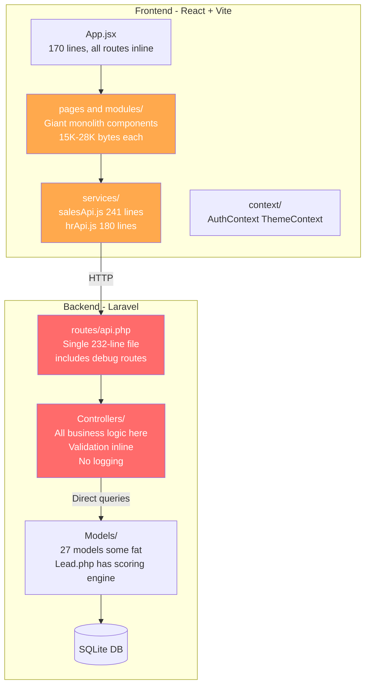
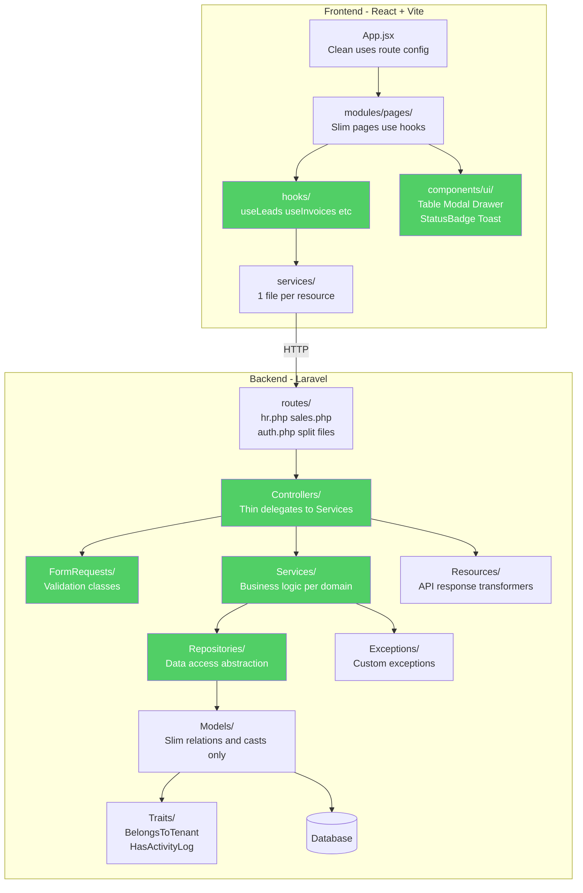
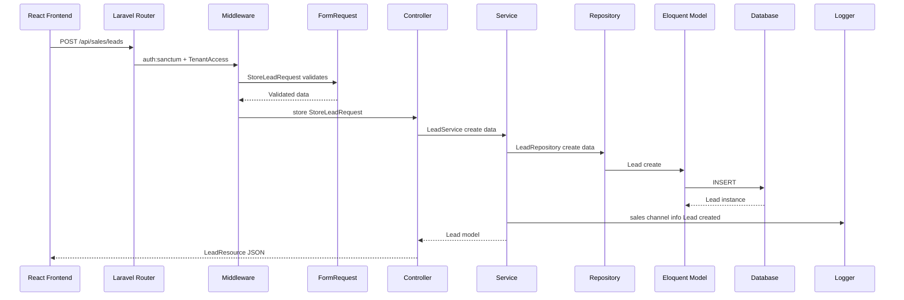

# 🔧 Sangoe CRM — Refactoring Plan

> **Date:** 2026-07-09 | **Status:** Proposed

---

## 1. Key Issues Identified

### 🔴 Critical

| # | Issue | Where | Impact |
|---|-------|-------|--------|
| 1 | **No Service Layer** — All business logic in Controllers | All 19 controllers | Untestable, tightly coupled |
| 2 | **No Form Requests** — Validation inline in every method | All controller methods | Duplicated rules, no reuse |
| 3 | **No Structured Logging** — Zero `Log::` calls, errors swallowed | All try/catch blocks | Blind to production issues |
| 4 | **No Custom Exceptions** — Raw `abort()` / generic catch | Controllers + Models | Poor error context |
| 5 | **No Repository Pattern** — Models queried directly | All controllers | No abstraction layer |

### 🟡 Moderate

| # | Issue | Where |
|---|-------|-------|
| 6 | **Fat Models** — Lead.php has scoring + lifecycle + logging (239 lines) | `app/Models/Lead.php` |
| 7 | **Monolith routes** — Single `api.php` (232 lines) | `routes/api.php` |
| 8 | **No API Resources** — Raw arrays, `formatUser()` in controller | `AuthController` |
| 9 | **No Traits** — `tid()`, `authorize()` copy-pasted everywhere | All Sales/HR controllers |
| 10 | **Frontend: Monolith API** — `salesApi.js` (241 lines, 10+ resources) | `services/salesApi.js` |
| 11 | **Frontend: No error boundary or toast system** | Global |
| 12 | **Frontend: Giant pages** — Invoices.jsx (27K), Proposals.jsx (24K) | `modules/sales/pages/` |
| 13 | **No shared UI components** — No Table, Modal, Drawer | `components/` |
| 14 | **Test scripts in root** — `check_users.php`, `test_api.php` | `backend/` root |
| 15 | **Debug routes in production** — `/test-dashboard`, `/test-hr-dashboard` | `routes/api.php` |

---

## 2. Architecture Diagrams

### BEFORE (Current)



### AFTER (Refactored)



---

## 3. Refactored Folder Structure

### 3.1 Backend (`backend/app/`)

```
app/
├── Exceptions/
│   ├── Handler.php                     # Global exception handler with structured JSON + logging
│   ├── BusinessException.php           # Base class for business rule violations
│   ├── UnauthorizedTenantException.php # Tenant mismatch (replaces raw abort 403)
│   └── ResourceNotFoundException.php   # Domain-specific 404s
│
├── Http/
│   ├── Controllers/
│   │   ├── Controller.php              # Base controller
│   │   ├── Api/
│   │   │   ├── Auth/
│   │   │   │   └── AuthController.php            # Thin — calls AuthService
│   │   │   ├── Hr/
│   │   │   │   ├── ManpowerRequestController.php # Thin — calls ManpowerRequestService
│   │   │   │   ├── JobPostingController.php
│   │   │   │   ├── CandidateController.php
│   │   │   │   ├── InterviewController.php
│   │   │   │   ├── OfferController.php
│   │   │   │   ├── OnboardingController.php
│   │   │   │   ├── EmployeeController.php
│   │   │   │   └── HRDashboardController.php
│   │   │   └── Sales/
│   │   │       ├── LeadController.php            # Thin — calls LeadService
│   │   │       ├── LeadSettingController.php
│   │   │       ├── ProposalController.php
│   │   │       ├── EstimateController.php
│   │   │       ├── InvoiceController.php
│   │   │       ├── CreditNoteController.php
│   │   │       ├── DeliveryNoteController.php
│   │   │       ├── ItemController.php
│   │   │       └── SalesDashboardController.php
│   │   └── Traits/
│   │       └── ApiResponse.php         # success(), error(), paginated() response helpers
│   │
│   ├── Middleware/
│   │   ├── EnsureUserHasRole.php       # Existing role check
│   │   └── EnsureTenantAccess.php      # NEW — auto-scope queries to tenant
│   │
│   └── Requests/                       # NEW — Form Request validation classes
│       ├── Auth/
│       │   ├── LoginRequest.php        # email, password, role validation
│       │   ├── RegisterRequest.php     # Admin registration rules
│       │   ├── VendorRegisterRequest.php
│       │   ├── TPVRegisterRequest.php
│       │   └── ClientRegisterRequest.php
│       ├── Hr/
│       │   ├── StoreManpowerRequest.php
│       │   ├── UpdateManpowerStatusRequest.php
│       │   ├── StoreCandidateRequest.php
│       │   └── StoreJobPostingRequest.php
│       └── Sales/
│           ├── StoreLeadRequest.php
│           ├── UpdateLeadRequest.php
│           ├── StoreInvoiceRequest.php
│           ├── StoreProposalRequest.php
│           ├── StoreEstimateRequest.php
│           └── RecordPaymentRequest.php
│
├── Models/                             # SLIMMED — relations, casts, scopes only
│   ├── Traits/
│   │   ├── BelongsToTenant.php         # scopeForTenant + auto-set tenant on create
│   │   └── HasActivityLog.php          # logActivity() extracted from Lead model
│   ├── User.php
│   ├── Tenant.php
│   ├── Lead.php                        # Relations + casts ONLY (scoring moved to Service)
│   ├── LeadStatus.php
│   ├── LeadSource.php
│   ├── LeadActivity.php
│   ├── LeadNote.php
│   ├── LeadGoal.php
│   ├── LeadQuestionnaire.php
│   ├── LeadQuestionnaireField.php
│   ├── LeadQuestionnaireResponse.php
│   ├── Proposal.php
│   ├── Estimate.php
│   ├── SalesInvoice.php
│   ├── SalesLineItem.php
│   ├── SalesItem.php
│   ├── SalesPayment.php
│   ├── CreditNote.php
│   ├── DeliveryNote.php
│   ├── HrManpowerRequest.php
│   ├── HrJobPosting.php
│   ├── HrCandidate.php
│   ├── HrInterviewRound.php
│   ├── HrOffer.php
│   ├── HrOnboarding.php
│   ├── HrEmployee.php
│   └── HrApprovalHistory.php
│
├── Services/                           # NEW — All business logic lives here
│   ├── Auth/
│   │   └── AuthService.php            # login, register, logout orchestration
│   ├── Hr/
│   │   ├── ManpowerRequestService.php # Create, approve, reject, assign logic
│   │   ├── CandidateService.php       # CRUD + LinkedIn parse + stage changes
│   │   ├── InterviewService.php       # Schedule, feedback, notifications
│   │   ├── OfferService.php           # Generate, send, update status
│   │   ├── OnboardingService.php      # Step toggling + completion checks
│   │   └── HRDashboardService.php     # Aggregate stats
│   └── Sales/
│       ├── LeadService.php            # CRUD + assign + convert + bulk actions
│       ├── LeadScoringService.php     # Scoring engine extracted from Lead model
│       ├── LeadSettingService.php     # Statuses, sources, goals, questionnaires
│       ├── ProposalService.php        # CRUD + send + status transitions
│       ├── EstimateService.php        # CRUD + convert-to-invoice
│       ├── InvoiceService.php         # CRUD + payments + overdue checks
│       ├── CreditNoteService.php      # Create + apply + refund
│       ├── DeliveryNoteService.php    # CRUD + mark delivered
│       └── SalesDashboardService.php  # Revenue stats aggregation
│
├── Repositories/                       # NEW — Data access abstraction
│   ├── BaseRepository.php            # Abstract with findById, create, update, delete
│   ├── Hr/
│   │   ├── ManpowerRequestRepository.php
│   │   ├── CandidateRepository.php
│   │   └── EmployeeRepository.php
│   └── Sales/
│       ├── LeadRepository.php         # Scoped queries: active, lost, kanban, filters
│       ├── InvoiceRepository.php
│       ├── ProposalRepository.php
│       └── EstimateRepository.php
│
├── Resources/                          # NEW — API Response transformers
│   ├── UserResource.php              # Replaces formatUser() in AuthController
│   ├── TenantResource.php            # Replaces formatTenant()
│   ├── Hr/
│   │   ├── ManpowerRequestResource.php
│   │   └── CandidateResource.php
│   └── Sales/
│       ├── LeadResource.php
│       ├── LeadCollection.php
│       ├── InvoiceResource.php
│       └── ProposalResource.php
│
└── Providers/
    └── AppServiceProvider.php         # Bind interfaces to implementations
```

### 3.2 Backend Routes (Split)

```
routes/
├── api.php          # Only loads sub-route files
├── auth.php         # /api/auth/* routes
├── hr.php           # /api/hr/* routes
└── sales.php        # /api/sales/* routes including leads
```

### 3.3 Logging Strategy

Add module-specific channels in `config/logging.php`:

```
Channel      | File                        | What gets logged
------------ | --------------------------- | --------------------------------
auth         | storage/logs/auth.log       | Login, register, logout, failures
hr           | storage/logs/hr.log         | Approvals, stage changes, offers
sales        | storage/logs/sales.log      | Invoices, payments, conversions
errors       | storage/logs/errors.log     | All caught exceptions
```

**Rules for every Service method:**
- INFO on successful operations with entity ID and tenant
- WARNING on failed validation or auth attempts
- ERROR on caught exceptions with full stack context

### 3.4 Frontend (`frontend/src/`)

```
src/
├── app/
│   ├── App.jsx                        # Clean shell, imports route config
│   ├── routes.jsx                     # NEW — All route definitions extracted
│   └── providers.jsx                  # NEW — Wraps Theme + Auth + Toast
│
├── components/
│   ├── layout/
│   │   ├── AppShell.jsx               # Existing
│   │   ├── Header.jsx                 # Existing
│   │   ├── Sidebar.jsx                # Existing
│   │   └── MobileBottomNav.jsx        # Existing
│   └── ui/                            # NEW — Reusable design-system
│       ├── DataTable.jsx              # Sortable, filterable table
│       ├── Modal.jsx                  # Generic modal wrapper
│       ├── Drawer.jsx                 # Slide-in panel for create/edit
│       ├── StatusBadge.jsx            # Moved from sales/components
│       ├── KPICard.jsx                # Stat cards extracted from dashboards
│       ├── EmptyState.jsx             # No data placeholder
│       ├── ConfirmDialog.jsx          # Delete/action confirmation
│       ├── Toast.jsx                  # Toast notification system
│       ├── Pagination.jsx             # Page controls
│       └── FormField.jsx              # Label + input + error wrapper
│
├── context/
│   ├── AuthContext.jsx                # Existing unchanged
│   └── ThemeContext.jsx               # Existing unchanged
│
├── hooks/                             # NEW — Data-fetching and state hooks
│   ├── useApiQuery.js                 # Generic fetch with loading/error states
│   ├── useLeads.js                    # Leads CRUD + kanban + summary
│   ├── useInvoices.js                 # Invoice operations
│   ├── useProposals.js                # Proposal operations
│   ├── useEstimates.js                # Estimate operations
│   ├── useCandidates.js               # Candidate operations
│   ├── useManpowerRequests.js         # HR manpower request operations
│   └── useToast.js                    # Toast context hook
│
├── lib/
│   ├── api.js                         # Axios instance existing
│   ├── constants.js                   # NEW — Status enums, color maps
│   └── formatters.js                  # NEW — Currency, date, phone formatters
│
├── modules/
│   ├── hr/
│   │   ├── HRLayout.jsx
│   │   ├── components/                # NEW — HR-specific reusable components
│   │   │   ├── ApprovalBadge.jsx
│   │   │   └── CandidateCard.jsx
│   │   └── pages/                     # Existing pages, slimmed down
│   └── sales/
│       ├── SalesLayout.jsx
│       ├── components/
│       │   ├── ActivityTimeline.jsx    # Existing
│       │   ├── LineItemsTable.jsx      # Existing
│       │   ├── LeadKanbanBoard.jsx     # NEW — Extracted from Leads.jsx
│       │   └── InvoiceLineEditor.jsx   # NEW — Extracted from Invoices.jsx
│       └── pages/                     # Existing pages, slimmed down
│
├── services/                          # SPLIT — 1 file per resource
│   ├── authApi.js                     # Login, register, logout
│   ├── leadApi.js                     # Leads CRUD + actions
│   ├── leadSettingsApi.js             # Statuses, sources, goals
│   ├── invoiceApi.js                  # Invoice CRUD + payments
│   ├── proposalApi.js                 # Proposal CRUD
│   ├── estimateApi.js                 # Estimate CRUD + convert
│   ├── creditNoteApi.js               # Credit note operations
│   ├── deliveryNoteApi.js             # Delivery note operations
│   ├── itemApi.js                     # Items catalog
│   ├── hrApi.js                       # HR module API calls
│   └── dashboardApi.js               # Sales + HR dashboard stats
│
├── router/
│   └── ProtectedRoute.jsx            # Existing
├── index.css
└── main.jsx
```

---

## 4. Refactoring Example

### Controller Before vs After

**BEFORE** (fat controller):
```php
public function store(Request $request) {
    $validated = $request->validate([...20 rules...]);
    DB::beginTransaction();
    try {
        $invoice = SalesInvoice::create([...$validated, 'tenant_id' => $this->tid()]);
        $this->syncLineItems($invoice, $request->input('line_items', []));
        $invoice->recalcTotals();
        DB::commit();
        return response()->json($invoice, 201);
    } catch (\Exception $e) {
        DB::rollBack();
        return response()->json(['error' => $e->getMessage()], 500);
    }
}
```

**AFTER** (thin controller + service + form request):
```php
// Controller — 3 lines
public function store(StoreInvoiceRequest $request) {
    $invoice = $this->invoiceService->create($request->validated());
    return new InvoiceResource($invoice);
}

// Service — business logic + logging
class InvoiceService {
    public function create(array $data): SalesInvoice {
        return DB::transaction(function () use ($data) {
            $invoice = $this->repo->create($data);
            $this->syncLineItems($invoice, $data['line_items'] ?? []);
            $invoice->recalcTotals();
            Log::channel('sales')->info('Invoice created', [
                'id' => $invoice->id, 'tenant' => $data['tenant_id']
            ]);
            return $invoice;
        });
    }
}
```

---

## 5. Files to Delete

| File | Reason |
|------|--------|
| `backend/check_users.php` | Debug script |
| `backend/create_user.php` | Use seeders instead |
| `backend/test_api.php` | Debug script |
| `backend/test_dashboard.php` | Debug script |
| `backend/fix_zip.php` | One-time utility |
| `backend/setup.php` | Should be artisan command |
| `backend/parse_pdf.php` | Move to Console/Commands |
| `backend/$l)` | Corrupted junk file |
| `CRM/extract_clean.php` | Root-level utility |
| `CRM/extract_pdf.py` | Root-level utility |
| `CRM/read_pdf.php` | Root-level utility |
| `CRM/prd_clean.txt` | Empty file |
| `CRM/prd_extracted.txt` | 223KB extracted text |
| Debug routes in api.php | `/test-dashboard`, `/test-hr-dashboard` |

---

## 6. Migration Strategy (Phased)

### Phase 1: Foundation (Week 1)
- Create `Exceptions/Handler.php` with structured JSON errors
- Create `Http/Controllers/Traits/ApiResponse.php` trait
- Create `Models/Traits/BelongsToTenant.php` trait
- Add logging channels to `config/logging.php`
- Split `routes/api.php` into module files
- Delete debug files and routes

### Phase 2: Backend Services (Week 2)
- Create all Service classes extracting logic from Controllers
- Create FormRequest validation classes for all endpoints
- Create API Resource classes for response transformation
- Add `Log::` calls to every Service method

### Phase 3: Repositories (Week 3)
- Create `BaseRepository` with shared CRUD operations
- Create domain-specific repositories
- Wire Services to use Repositories instead of direct Model calls

### Phase 4: Frontend (Week 3-4)
- Create shared UI components (DataTable, Modal, Drawer, Toast)
- Split `salesApi.js` into per-resource API files
- Create custom hooks (useLeads, useInvoices, etc.)
- Extract route config from App.jsx
- Break down giant page components into sub-components

### Phase 5: Polish (Week 4)
- Add React error boundaries
- Add toast notifications for all operations
- Write model factories for testing
- Add API integration tests
- Final cleanup and documentation

---

## 7. Request Lifecycle — Refactored



---

> **Note:** Each phase is non-breaking. Old code works while new patterns are introduced incrementally. Start with Phase 1 for the safety net before restructuring logic.
